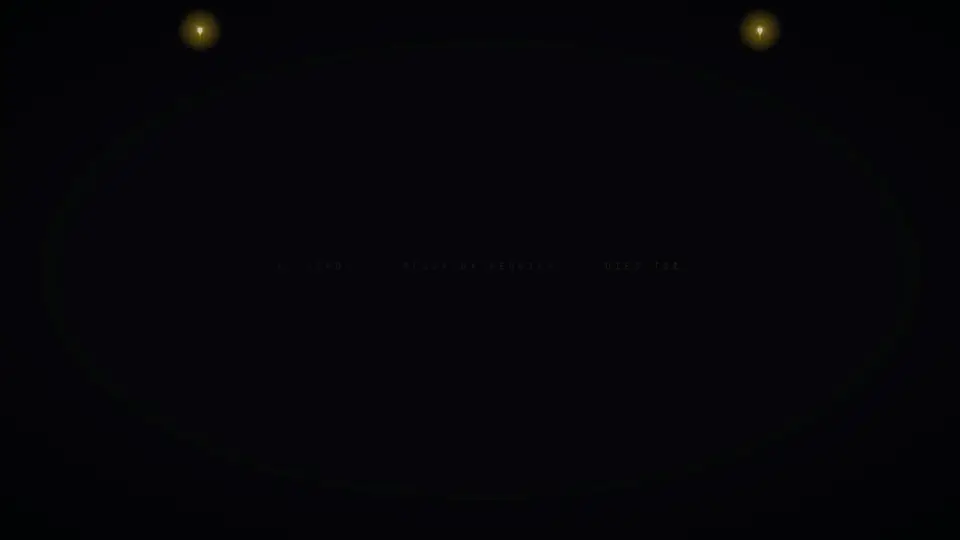

# Maestro Web

A webcam conducting rhythm game in the browser, inspired by the VR game *Maestro*.
Conduct Verdi's *Dies Irae* (Easy / Medium / Hard / Expert, release charts) with your hands: strokes with the right hand; cues, crescendo/decrescendo, sustain, cut and contain with the left.

**Play:** https://kairess.github.io/maestro-web/ (desktop Chrome/Edge, webcam required)

<a href="showreel/maestro-web-showreel-web.mp4"></a>

**Showreel:** [30 s video with sound](showreel/maestro-web-showreel-web.mp4) · made with HTML/Canvas and headless Chrome, see [showreel/](showreel/)

## Tech

- **Vite + TypeScript**: static site, no UI framework (plain DOM HUD)
- **Three.js**: first-person 3D scene (hands, quill baton, notes, hold-note ridges, backdrop)
- **MediaPipe Tasks Vision**: Hand Landmarker for tracking, Pose Landmarker for body calibration (WASM + GPU, self-hosted models)
- **Body-frame calibration**: shoulder-based coordinate frame, so strokes read the same from any webcam angle
- **One Euro filter + momentum coasting**: smooth, low-latency hand motion that survives brief tracking loss
- **Web Audio API**: master clock for notes and judging, sample-locked normal/fail tracks with a health-driven crossfade, limiter
- **Vitest + Puppeteer**: judge/tracking unit tests, a bot that plays the whole chart, headless smoke tests

## Run

```bash
npm install
curl -L -o public/mediapipe/pose_landmarker_full.task https://storage.googleapis.com/mediapipe-models/pose_landmarker/pose_landmarker_full/float16/1/pose_landmarker_full.task
curl -L -o public/mediapipe/pose_landmarker_lite.task https://storage.googleapis.com/mediapipe-models/pose_landmarker/pose_landmarker_lite/float16/1/pose_landmarker_lite.task
curl -L -o public/mediapipe/hand_landmarker.task https://storage.googleapis.com/mediapipe-models/hand_landmarker/hand_landmarker/float16/1/hand_landmarker.task
npm run dev        # https://localhost:5173 (use npm run dev:lan for other devices)
npm test
npm run deploy     # build and publish to GitHub Pages (gh-pages branch)
```

---

# Maestro Web (한국어)

VR 지휘 리듬게임 *Maestro* 에서 영감을 받은 브라우저용 웹캠 지휘 게임입니다.
오른손으로 박자를 젓고, 왼손으로 큐·크레셴도/데크레셴도·서스테인·컷·컨테인을 표현하며 베르디 *Dies Irae* 를 지휘합니다 (Easy / Medium / Hard / Expert, 정식 출시판 채보).

**플레이:** https://kairess.github.io/maestro-web/ (데스크톱 Chrome/Edge, 웹캠 필요)

**쇼릴:** [30초 영상 (소리 포함)](showreel/maestro-web-showreel-web.mp4) · 맨 위 미리보기를 누르면 재생됩니다. 제작 방법은 [showreel/](showreel/)에 있습니다.

## 사용 기술

- **Vite + TypeScript**: 정적 사이트, UI 프레임워크 없이 DOM으로 HUD 구성
- **Three.js**: 1인칭 3D 장면 (손, 깃펜 지휘봉, 노트, 지속 노트, 배경)
- **MediaPipe Tasks Vision**: 손 추적은 Hand Landmarker, 몸 기준 캘리브레이션은 Pose Landmarker (WASM + GPU, 모델 자체 호스팅)
- **몸 기준 좌표계 캘리브레이션**: 어깨 기준으로 좌표를 잡아 웹캠 각도와 상관없이 같은 동작으로 인식
- **One Euro 필터 + 관성 이동**: 지연이 적고 부드러운 손 움직임, 추적이 잠깐 끊겨도 이어서 움직임
- **Web Audio API**: 노트와 판정의 기준 시계, 정상/실패 트랙을 샘플 단위로 맞춰 체력에 따라 크로스페이드, 리미터
- **Vitest + Puppeteer**: 판정·추적 단위 테스트, 채보 전체를 플레이하는 봇, 헤드리스 스모크 테스트

실행 방법은 위 **Run** 섹션과 같습니다.
